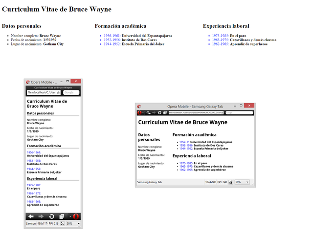
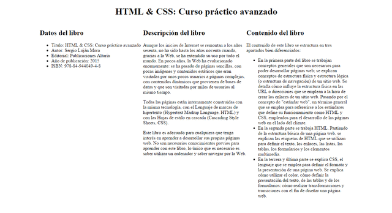

# Ejercicios de repaso de CSS

## Ejercicios

### 1. Maquetación diseño responsive
### Enunciado

A partir de la página web que se te proporciona, debes escribir las reglas CSS necesarias para lograr una página web que tenga el mismo aspecto que la siguiente imagen en la que se muestra la página web visualizada en tres dispositivos con diferentes resoluciones de pantalla:

[](./img/maquetacion-diseno-grande-1.png)

Esta página posee un diseño adaptable con tres puntos de ruptura:

- Hasta 600 px: un diseño a una columna.
- A partir de 600 px y hasta 1200 px: un diseño a dos columnas.
- A partir de 1200 px: un diseño a tres columnas.

Fíjate bien en las capturas de pantalla e intenta lograr el mismo resultado.

Puedes modificar el código HTML proporcionado para añadir los identificadores y clases que necesites. También puedes añadir etiquetas `<div>` para definir elementos contenedores en la página.


### Código base

```
<!DOCTYPE html>
<html>
<head>
<meta charset="utf-8" />
<title>Curriculum Vitae de Bruce Wayne</title>
</head>
<body>

<h1>Curriculum Vitae de Bruce Wayne</h1>

<h2>Datos personales</h2>
<ul>
<li>Nombre completo: <strong>Bruce Wayne</strong></li>
<li>Fecha de nacimiento: <strong>1/5/1939</strong></li>
<li>Lugar de nacimiento: <strong>Gotham City</strong></li>
</ul>

<h2>Formación académica</h2>
<ul>
<li>1956-1961: <strong>Universidad del Espantapájaros</strong></li>
<li>1952-1956: <strong>Instituto de Dos Caras</strong></li>
<li>1944-1952: <strong>Escuela Primaria del Joker</strong></li>
</ul>

<h2>Experiencia laboral</h2>
<ul>
<li>1975-1985: <strong>En el paro</strong></li>
<li>1965-1975: <strong>Cazavillanos y demás chusma</strong></li>
<li>1962-1965: <strong>Aprendiz de superhéroe</strong></li>
</ul>

</body>
</html>
```

### 2. Maquetación diseño responsive
### Enunciado

A partir de la página web que se te proporciona, debes escribir las reglas CSS necesarias para lograr una página web que tenga el mismo aspecto que la siguiente imagen en la que se muestra la página web visualizada en tres dispositivos con diferentes resoluciones de pantalla:



Esta página posee un diseño adaptable con tres puntos de ruptura:

- Hasta 600 px: no se aplica un diseño a la página web.
- A partir de 600 px y hasta 1200 px: un diseño a dos columnas.
- A partir de 1200 px: un diseño a tres columnas.

Fíjate bien en las capturas de pantalla e intenta lograr el mismo resultado. Algunas pistas:

- Hasta 600 px: los datos del libro no se muestran en forma de lista, se muestran todos juntos en una línea y separados por punto y coma.
- A partir de 600 px y hasta 1200 px: los apartados del contenido del libro se muestran con un diseño a tres columnas.

Puedes modificar el código HTML proporcionado para añadir los identificadores y clases que necesites. También puedes añadir etiquetas `<div>` para definir elementos contenedores en la página.

### Código base

```
<!DOCTYPE html>
<html>
<head>
<meta charset="utf-8" />
<title>HTML &amp; CSS: Curso práctico avanzado</title>
</head>
<body>
<h1>HTML &amp; CSS: Curso práctico avanzado</h1>

<h2>Datos del libro</h2>

<ul>
<li>Título: HTML &amp; CSS: Curso práctico avanzado</li>
<li>Autor: Sergio Luján Mora</li>
<li>Editorial: Publicaciones Altaria</li>
<li>Año de publicación: 2015</li>
<li>ISBN: 978-84-944049-4-8</li>
</ul>


<h2>Descripción del libro</h2>

<p>
Aunque los inicios de Internet se remontan a los años sesenta, no ha sido hasta los años noventa cuando, gracias a la Web, se ha extendido su uso por todo el mundo. En pocos años, la Web ha evolucionado enormemente: se ha pasado de páginas sencillas, con pocas imágenes y contenidos estáticos que eran visitadas por unos pocos usuarios a páginas complejas, con contenidos dinámicos que provienen de bases de datos y que son visitadas por miles de usuarios al mismo tiempo.
</p>

<p>
Todas las páginas están internamente construidas con la misma tecnología, con el Lenguaje de marcas de hipertexto (Hypertext Markup Language, HTML) y con las Hojas de estilo en cascada (Cascading Style Sheets, CSS).
</p>

<p>
Este libro es adecuado para cualquiera que tenga interés en aprender a desarrollar sus propias páginas web. No son necesarios conocimientos previos para aprender con este libro, lo único que es necesario es saber utilizar un ordenador y saber navegar por la Web.
</p>


<h2>Contenido del libro</h2>

<p>
El contenido de este libro se estructura en tres apartados bien diferenciados:
</p>

<ul>
<li>En la primera parte del libro se trabajan conceptos generales que son necesarios para poder desarrollar páginas web; se explican conceptos de estructura física y estructura lógica (o estructura de navegación) de un sitio web. Se detalla cómo influye la estructura física en las URL o direcciones que se emplean a la hora de crear los enlaces de un sitio web. Pasando por el concepto de "estándar web", un término general que se emplea para refererirse a los estándares que define su funcionamiento como HTML y CSS, empleados para el desarrollo de las páginas web en el lado del cliente.</li>

<li>En la segunda parte se trabaja HTML. Partiendo de la estructura básica de una página web, se explican las etiquetas de HTML que se utilizan para definir el texto, los enlaces, las listas, las tablas, los formularios y los elementos multimedia.</li>

<li>En la tercera y última parte se explica CSS, el lenguaje que se emplea para definir el formato y la presentación de una página web. Se explica cómo utilizar el color, cómo definir la presentación del texto, de las tablas y de los formularios; cómo realizar transformaciones y transiciones con el fin de diseñar una página web.</li>
</ul>
</body>
</html>
````
